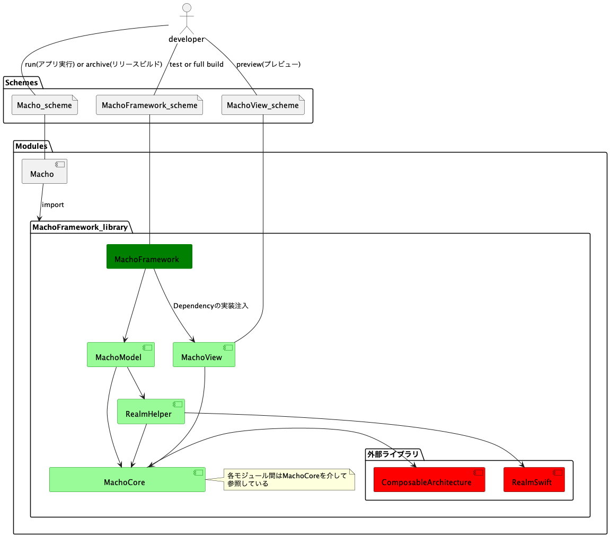

# マルチモジュール構成について

モジュール間の依存を疎結合にするために、モジュール間の参照は`MachoCore`モジュールを介して行うようにしている。
`MachoView`(画面モジュール)は`MachoModule`にしか依存していないため、Preview ビルド高速化に成功している。
画面開発を行うときは、参照スキームを`MachoView`に設定することで、ビルド対象を限定することができて、Preview のビルドが短時間で済む様になっている。

## 構成図

