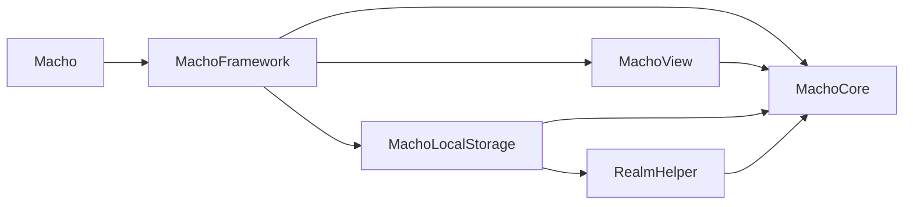

## アプリ全体の依存関係

複数ののモジュールにまたがる型を`MachoCore`に持たせることで、
各モジュールは直接依存せずに済む。
例えば、`MachoView`モジュールで、ローカルストレージに読み書きする実装を`@Dependency`で呼び出しているが、`MachoCore`に定義されたインターフェースを知っているだけで、`Realm`などに依存した実装の詳細には関心がない。
こうすることで、`MachoView`モジュールビルド時には Realm を含む、ローカルストレージ関連などの巨大なコードをビルドせずに済むので、Preview 時も高速でビルドできる。
また、UI 層やドメイン層は、Data 層と切り離され Data 層の依存ライブラリとも疎結合になるので、ライブラリの変更など比較的大規模な変更であっても、最小限の影響範囲で対応できる、変更容易性を備えることもできる。

## それぞれの Module の役割

| モジュール名      | 役割                                                                               |
| ----------------- | ---------------------------------------------------------------------------------- |
| Macho             | アプリケーション実行のエントリーポイント                                           |
| MachoFramework    | アプリ起動時の実装を UI 層に DI する                                               |
| MachoView         | アプリの UI 層とドメイン層をまとめたモジュールで、画面の表示と振る舞いに関心を持つ |
| MachoLocalStorage | アプリのローカルストレージにアクセスする実装に関心を持つ                           |
| MachoCore         | 前モジュールにまたがる IF や実装を保持する                                         |
| RealmHelper       | Realm の実装をスレッドセーフに保って使用するためのラッパー                         |
