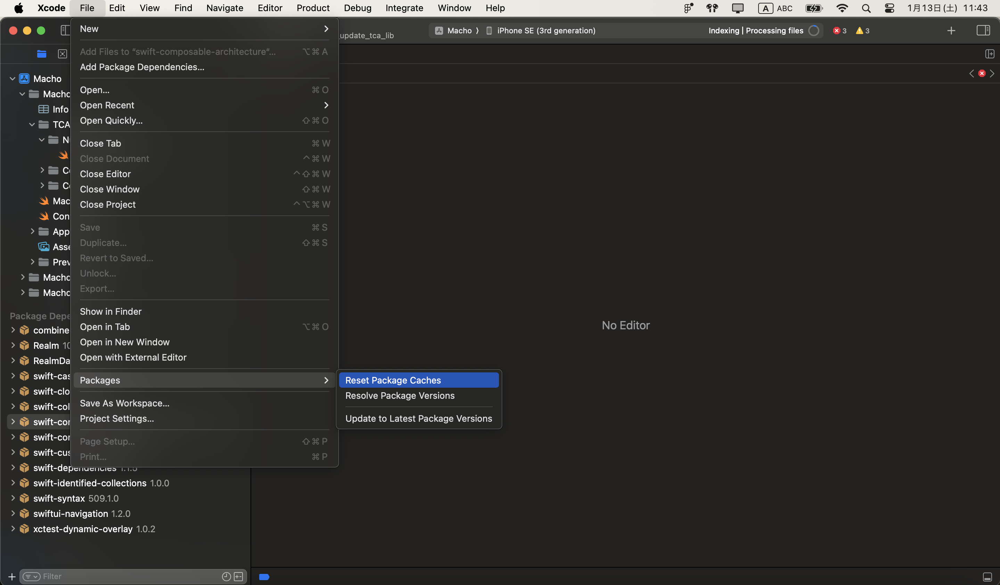
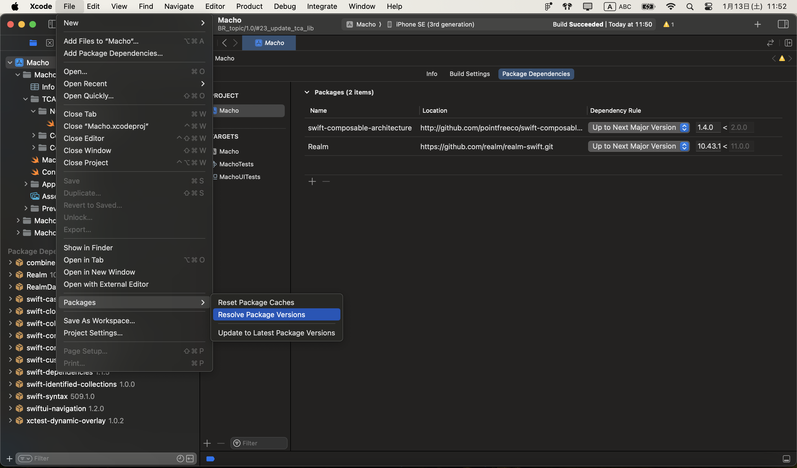

# SPMでのパッケージアップデート方法

以下手順を実行してパッケージのアップデートを行う

## ①SPMのキャッシュを削除する
Xcode -> File -> Packages -> Reset Packages Caches を実行

## ②SPMのバージョンを更新する
プロジェクトファイル -> Package Dependencies -> Dependencies Ruleのバージョンを任意の値に更新

【参考】 
[バージョンアップデート方法](https://saisai-weblink.com/swift-package-manager%E3%81%A7%E3%83%A9%E3%82%A4%E3%83%96%E3%83%A9%E3%83%AA%E3%81%AE%E3%83%90%E3%83%BC%E3%82%B8%E3%83%A7%E3%83%B3%E3%82%A2%E3%83%83%E3%83%97%E3%82%92%E3%81%99%E3%82%8B%E6%96%B9/)

## ③SPMの依存関係を更新する
Xcode -> File -> Packages -> Resolve Package Versions

